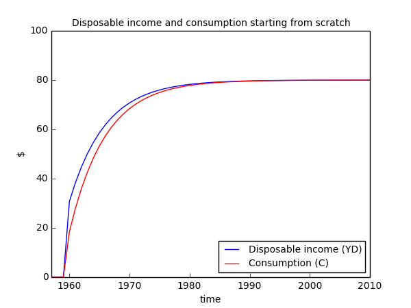

.. _example-simulate:

***********************************************
Simulating Godley and Lavoie's (2007) Model SIM
***********************************************

The previous two sections set out the theory of Godley and Lavoie's (2007)
*Model SIM*, and, from this, how to build the model using FSIC. This section
explains how to use the script so generated to run the simulations set out in
Chapter 3 of Godley and Lavoie (2007).

.. _example-simulate-requirements:

Model inputs
============

The ``sim.py`` script that contains the model is designed to be run from the
command line. However, as currently defined, the model is only a set of
relationships. There are no input values. In order to solve the model, the
script must be called with a number of additional arguments, to control the run.

This section will explain the various arguments necessary to solve the model. It
will first explain the individual arguments, before putting them together to run
the model for the first numerical example in Godley and Lavoie (2007). In this
first example, the model starts from a situation of no economic activity or
accumulated wealth until there is a stimulus from the government.

In the current example, the run requires the following:

* The start and end periods for the run
* Values for the parameters of the consumption function: |alpha_1| and |alpha_2|
* Values for the three exogenous variables: |G_d|, |theta| and |W|
* A file to store the results from the run

.. |alpha_1| replace:: :math:`\alpha_1`
.. |alpha_2| replace:: :math:`\alpha_2`
.. |G_d| replace:: :math:`G_d`
.. |theta| replace:: :math:`\theta`
.. |W| replace:: :math:`W`

The span of the run is set by the ``--span`` argument, to define the start and
end periods, inclusively. In the case of a dynamic model, it is also necessary
to specify a 'past' period, to ensure that there are values for period *t-1* in
period *t*::

    --span 1960 2010 --past 1957

Next, it is necessary to define the values of the parameters |alpha_1| and
|alpha_2|, otherwise, the model values will default to zero. In the case of
parameters, the values should be constant over the entire run. For this purpose,
there is the ``--define`` argument (``-D`` serves the same purpose)::

    --define alpha_1=0.6 alpha_2=0.4

The above statement sets the value of |alpha_1| to ``0.6`` and |alpha_2| to
``0.4``.

In same can be applied to |theta| and |W|, this time, using ``-D`` instead of
``--define``::

    -D theta=0.2 W=1

The remaining value is for |G_d|, which differs from the previous four variables
in this run because its value changes over the solution period, from zero in the
first year, to 20 in the second and thereafter. This is possible with the
``--set`` function, that allows the user to supply a Python expression to assign
values to a list-like variable (specifically, a Pandas Series object)::

    --set G_d[\'1960\':]=20

.. Important::
   The indexing argument must be quoted in the call. These quotes may need to be
   escaped from the command line.

Finally, the model needs to save the results from the run. This requires the
argument ``--output`` (or, alternatively, ``-o``)::

    --output results.csv

Putting it all together, the final command-line call is as follows::

    python sim.py solve --span 1960 2010 --past 1957 --define alpha_1=0.6 alpha_2=0.4 -D theta=0.2 W=1 --set G_d[\'1960\':]=20 --output results.csv

This runs the model and saves the results to ``results.csv``, which contains the information necessary to reproduce Table 3.4 from Godley and Lavoie (2007):

.. csv-table:: Table 3.4: The impact of $20 of government expenditures, with perfect foresight
   :header: "", |1|, |2|, |3|, |Infinity|
   :stub-columns: 1
   :widths: 15, 5, 5, 5, 5

   |G|,      0.0, 20.0, 20.0,  20.0
   |Y|,      0.0, 38.5, 47.9, 100.0
   |T|,      0.0,  7.7,  9.6,  20.0
   |YD|,     0.0, 30.8, 38.3,  80.0
   |C|,      0.0, 18.5, 27.9,  80.0
   |D(H_s)|, 0.0, 12.3, 10.4,   0.0
   |D(H_h)|, 0.0, 12.3, 10.4,   0.0
   |H|,      0.0, 12.3, 22.7,  80.0

.. |1| replace:: :math:`1`
.. |2| replace:: :math:`2`
.. |3| replace:: :math:`3`
.. |Infinity| replace:: :math:`\infty`

.. |G| replace:: :math:`G`
.. |Y| replace:: :math:`Y = G + C`
.. |T| replace:: :math:`T = \theta . Y`
.. |YD| replace:: :math:`YD = Y - T`
.. |C| replace:: :math:`C = \alpha _1 . YD + \alpha _2 . H_{-1}`
.. |D(H_s)| replace:: :math:`\Delta H_s = G - T`
.. |D(H_h)| replace:: :math:`\Delta H_h = YD - C`
.. |H| replace:: :math:`H`

.. Note::
   The rows |D(H_s)| and |D(H_h)| in the table above have to be calculated from
   the values in ``results.csv``, rather than extracted directly.

Disposable income and consumption evolve as follows, replicating Figure 3.2 from
Godley and Lavoie (2007):

.. _example-simulate-file-args:

Files of arguments
------------------

The example above requires a relatively large number of command-line
arguments. An alternative to providing the necessary arguments at the command
line is to pass one or more files of arguments with ``@`` as a prefix. For
example::

    python sim.py @solve_args.txt

would load the arguments from a file with name ``solve_args.txt``.

If passing arguments in this way, the input file must contain one argument per
line, as follows::

    solve
    --span
    1960
    2010
    --past
    1957
    --define
    alpha_1=0.6
    alpha_2=0.4
    -D
    theta=0.2
    W=1
    --set
    G_d[\'1960\':]=20
    --output
    results.csv

A mix of command-line and file arguments is also possible::

    python sim.py @solve_args.txt --set G_d[\'1960\':]=20 --output results.csv

.. _example-simulate-solve-args:

Solution arguments
==================

All the available arguments under the ``solve`` option (the only option
currently available in FSIC) can be displayed with the call::

    python sim.py solve -h

which then prints::

    usage: sim.py solve [-h] [-v] [-f INPUT [INPUT ...]] [-o OUTPUT [OUTPUT ...]]
                        [-D PARAMETER [PARAMETER ...]]
                        [--set EXPRESSION [EXPRESSION ...]] [--span PERIOD PERIOD]
                        [--past PERIOD]

    optional arguments:
      -h, --help            show this help message and exit
      -v, --verbose         print detailed solution output
      -f INPUT [INPUT ...], --input INPUT [INPUT ...]
                            input file(s) for model data
      -o OUTPUT [OUTPUT ...], --output OUTPUT [OUTPUT ...]
                            output file(s) for model results
      -D PARAMETER [PARAMETER ...], --define PARAMETER [PARAMETER ...]
                            set (time-invariant) model parameters
      --set EXPRESSION [EXPRESSION ...]
                            set (time-varying) model variables prior to run
      --span PERIOD PERIOD  set the start and end periods of the model run
      --past PERIOD         set the first historical period of the model run
